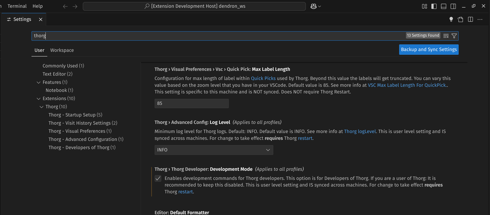

Thorg configuration/settings are changed through VSCode settings.

### Open Settings
- Open Command Palette ([[t.ext.vscode.how-to.open-command-palette]])
- In the Command Palette, search for `Preferences: Open Settings (UI)`
- Press Enter

### Filter for Thorg Settings
In the Settings search box, type `thorg` to filter for Thorg settings.

{max-width: 700px, display: block, margin: 0 auto, border: 5px solid black}

#### Through Search (if you know what you're looking for)
If you know what you're looking for, start typing the search term. VSCode settings will auto-update. 

<details>
<summary>Tip: Typing less in Settings leads to more precise results</summary>

As of 2025, typing less in VSCode settings is likely to yield better results than typing the full phrase, as it avoids overmatching unrelated terms.

For example if you type in 
```
thorg min visitation
```

You'll get the single setting for [[t.ext.configuration.values.visitHistory.minVisitationFocusTimeMillis]].

However, if you type the full setting name:
```
thorg min visitation focus time millis
```
You'll get matches unrelated to Thorg. 
</details>


#### Through Tree (if you're exploring)

If you don't know which settings you're looking for and want to explore available Thorg settings:

On the left-hand side in Settings, you'll see a tree view. Look under `Thorg` for configuration sections.

### More info
- [[t.ext.configuration.how-to-change-thorg-configuration.how-to-restart-thorg-for-config-changes]] - Most settings require a restart to take effect in early iterations of Thorg.