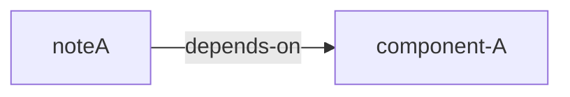

<div class="bordered">

#status.not-implemented: this is not implemented yet, but will be. You can start using the pattern of typed relationships to add consistency in defining relationship between notes, and later on these relationships will come to life in visualizations :). 
</div>


## Named link
To name a link, prefix it with a relationship note using the syntax `[[rel.<name-of-relationship>]]:[[some-dst-note]]`

### Example of **named** note links from note-A


```md
---
title: note-A
---

### Relationshps
- [[rel.depends-on]]:**[[component-A]]**
- [[rel.dependency-of]]:[[component-B]]
```

#### Dissecting one of the two named relationships above

```txt
[[rel.depends-on]]:**[[component-A]]**
```

- `[[rel.depends-on]]` is a note, but because it starts with the `rel.` hierarchy, it is treated as a special type of note: [[t.ext.data.type.relationship-note]].
- `[[component-A]]` is the destination of the note link. 

With `[[rel.depends-on]]:**[[component-A]]**` we create a named relationship of:
