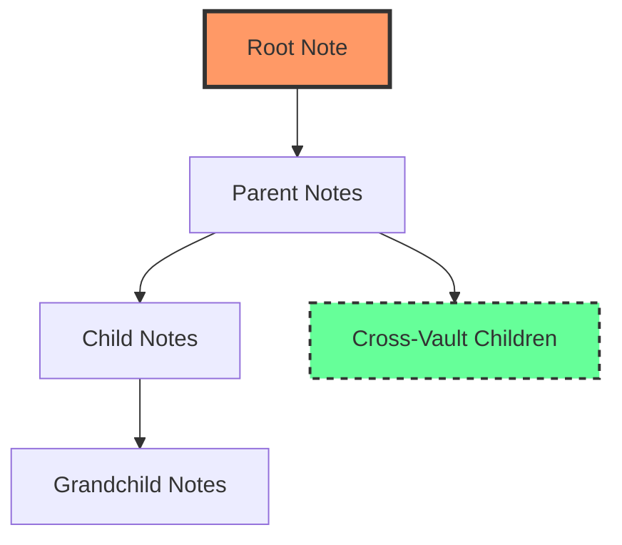

**Thorg** uses a dot-delimited hierarchy system to organize notes into logical, navigable structures, creating parent-child relationships that enable powerful organization and cross-referencing capabilities.

## Core Hierarchy Concepts

### Dot Notation
Thorg hierarchies use periods (`.`) as delimiters to establish parent-child relationships:

```txt
workspace/.thorg
workspace/vault-1/grandparent.parent.child.md
workspace/vault-1/grandparent.parent.md
workspace/vault-1/grandparent.md
```

Each additional dot represents a deeper level in the hierarchy:
- `grandparent` - **Root level**
- `grandparent.parent` - **Second level** 
- `grandparent.parent.child` - **Third level**


<details class="bordered xxsmall">
<summary>Subfolders in vaults in the future</summary>

![[t.ext.data.type.note.hierarchy.sub-folders-in-vault-in-the-future]]
</details>

## File Structure and Note Names

| Component | Description | Example |
| :--- | :--- | :--- |
| **File Path** | Physical location on disk | `/../workspace/vault-1/grandparent.parent.child.md` |
| **[[t.ext.data.type.note.name]]** | Hierarchical identifier (File path without vault path, without file extensions) | `grandparent.parent.child` |
| **Parent Note** | One level up in hierarchy | `grandparent.parent` |
| **Root Note** | Top-level ancestor | `grandparent` |

## Cross-Vault Hierarchy Support

Thorg's hierarchy system extends **across multiple vaults**, allowing you to maintain consistent organization while separating content by access level or purpose.

### Example: Public and Private Vaults

**Public Vault Structure:**
```txt
topics.programming.javascript.md
topics.programming.python.md
```

**Private Vault Addition:**
```txt
topics.programming.personal-notes.md
topics.programming.javascript.private-examples.md
```

The hierarchy remains intact across vaults, with all notes sharing the same ancestor (`topics.programming`).

## Navigation and Linking

### Wiki Links
Reference any note in the hierarchy using wiki links:
- `[[grandparent.parent.child]]` - Link to specific note
- `[[grandparent.parent]]` - Link to parent note

### Hierarchy Benefits



## Best Practices for Thorg Hierarchies

1. **Meaningful Names**: Use descriptive, **concise** terms that indicate content relationships (use [[title in frontmatter|t.ext.data.type.note.frontmatter.field.title]] for more verbose note names)
   - ✅ `projects.web-app.frontend.components`
   - ❌ `stuff.thing1.more.items`

2. **Logical Grouping**: Place related content under common ancestors
   ```txt
   documentation.api.endpoints.users
   documentation.api.endpoints.auth
   documentation.api.endpoints.products
   ```

3. **Sibling Organization**: Notes under one parent should be conceptually related
   ```txt
   tools.editors.vscode
   tools.editors.neovim
   tools.editors.sublime
   ```

