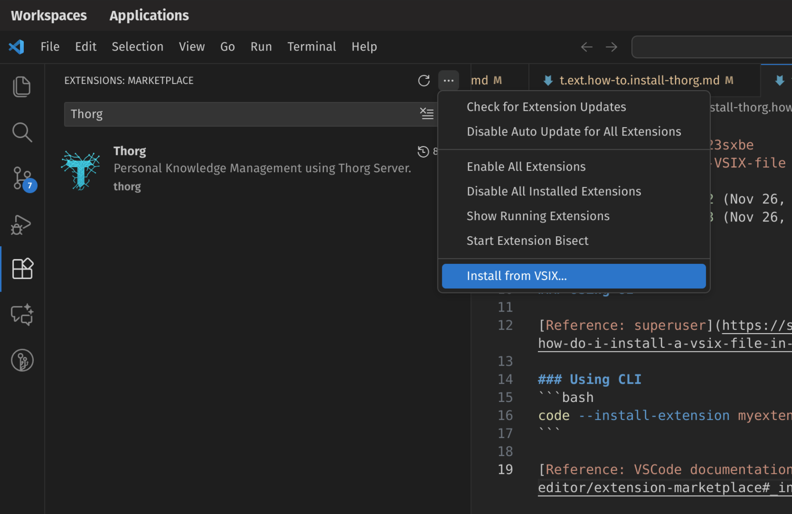

There are two ways to install the VSIX file that you downloaded as part of [[t.ext.how-to.install-thorg]]

### Using UI
{max-width: 500px, display: block, margin: 0 auto, border: 5px solid black}

Then choose the VSIX file that you downloaded as part of [[t.ext.how-to.install-thorg]].


### Using CLI
```bash
code --install-extension $thorg-downloaded-vsix-file
```

[Reference: VSCode documentation](https://code.visualstudio.com/docs/editor/extension-marketplace#_install-from-a-vsix)