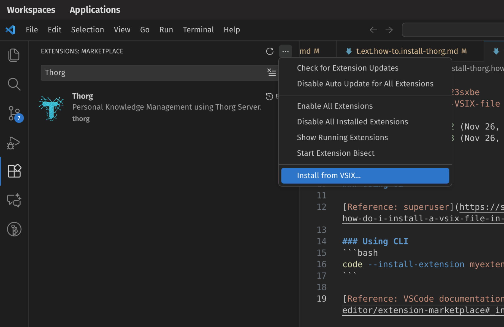

> **Note:** Most users should install Thorg directly from the [VS Code Marketplace](https://marketplace.visualstudio.com/items?itemName=thorgapp.thorg-vscode). These instructions are for manual VSIX installation (e.g., from [[t.ext.how-to.install-thorg.previous-releases]]).

### Using UI
{max-width: 500px, display: block, margin: 0 auto, border: 5px solid black}

Then choose the VSIX file.

### Using CLI
```bash
code --install-extension $thorg-downloaded-vsix-file
```

[Reference: VSCode documentation](https://code.visualstudio.com/docs/editor/extension-marketplace#_install-from-a-vsix)
